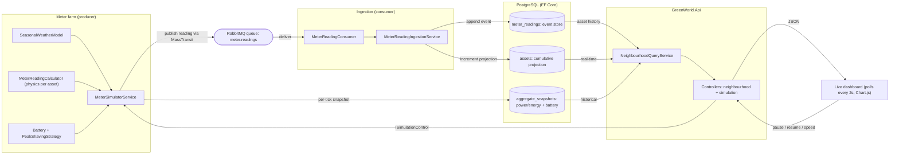

# GreenWorld

An end-to-end system that **simulates electricity consumption and generation in a
neighbourhood** and makes it observable over time. Meters emit readings that flow
through **RabbitMQ (via MassTransit)**; a consumer appends each reading to an
**event store** and folds it into per-asset **cumulative projections** in
**PostgreSQL (EF Core)**. Built on Clean Architecture (.NET 10).

You can answer, at any time:

- What is the simulated **date/time** and **weather/season**?
- What is the **current and historical neighbourhood load** (aggregate power/energy)?
- What is the **cumulative energy** (kWh) per asset/meter since simulation start?

## Domain model

```
Neighbourhood (aggregate root)
├── MeteredSite            (abstract, table-per-hierarchy)
│   ├── Household          (base load + optional PV / heat pump / home EV charger)
│   └── PublicFacility     (holds a public EV charger)   × 6
│        └── Asset[]       (each asset is its own meter)
└── NeighbourhoodAggregateSnapshot[]   (aggregate power/energy over time)
```

- A **Household** or **PublicFacility** owns a list of **Assets**. A house may
  hold several (e.g. PV + heat pump).
- Every **Asset** tracks **cumulative energy since simulation start** (kWh),
  split into consumed and generated, updated by folding in meter readings.
- **MeterReadingEvent** is the append-only source of truth (the event stream);
  asset cumulative fields are the fast read projection.

## Event-sourced pipeline

```
MeterSimulatorService ──publish──▶ RabbitMQ ──▶ MeterReadingConsumer
   (weather-driven readings)      (MassTransit)        │
        │                                              ▼
        │ writes                         MeterReadingIngestionService
        ▼                                   ├─ append MeterReadingEvent (event store)
  AggregateSnapshot (per tick)              └─ Asset.ApplyReading(...)  (projection)
        │                                              │
        └──────────────── PostgreSQL (EF Core) ◀───────┘
```

- **`MeterSimulatorService`** (hosted service) is the meter farm: each tick it
  computes every asset's reading from weather + time and **publishes it to
  RabbitMQ**, exactly as physical meters would. It also records a neighbourhood
  aggregate snapshot per tick.
- **`MeterReadingConsumer`** (MassTransit) ingests each reading in its own scope:
  appends the immutable event and updates the asset's cumulative projection in
  one unit of work.
- **Real-time reads** come from the O(1) projections; **historical reads** come
  from the aggregate snapshot series and the raw event store.

## System design



Two write paths land in Postgres: readings flow **meter → RabbitMQ → consumer →
event store + projection**, while the simulator writes **per-tick aggregate
snapshots** (including battery power/SoC/net-load-with-battery) directly. Reads are
served from the fast projections (real-time) and the snapshot series + event store
(historical).

## Solution layout

```
GreenWorld.Domain          # Entities, events, MeterReadingCalculator (physics), repo contracts
GreenWorld.Application      # Ingestion + query services, message + response DTOs, ports
GreenWorld.Infrastructure   # EF Core (Postgres), MassTransit/RabbitMQ, seeder, simulator
GreenWorld.Api             # Controllers + composition root
GreenWorld.SharedKernel     # NeighbourhoodConfiguration, base exceptions
GreenWorld.*.Tests          # xUnit
```

Dependency rule: `Api → Application → Domain ← Infrastructure`, all → `SharedKernel`.
(Infrastructure also references Application to implement its ports — the messaging
publisher/consumer and ingestion.)

## Run

Whole stack in containers (API + PostgreSQL + RabbitMQ):

```bash
docker compose up --build      # dashboard at http://localhost:8088/
```

Or run just the infrastructure and the API from your IDE / CLI:

```bash
docker compose up -d postgres rabbitmq   # RabbitMQ management UI on :15672
dotnet run --project GreenWorld.Api
```

On startup the API **applies EF migrations** and **seeds the neighbourhood once**
(30 households + 6 public facilities). The simulator then begins publishing
readings; watch the meters and aggregate move.

- **Live dashboard:** `http://localhost:8088/` in Docker (or your dev port when running
  the API directly) — a self-contained
  page that polls the API every 2s and charts aggregate consumption/generation/net
  power over time plus a live cumulative-per-meter table (Chart.js from CDN).
- **Swagger UI:** `/swagger`.

### API

| Method & route | Purpose |
|---|---|
| `GET  /api/neighbourhood` | Structure: sites + assets with cumulative energy |
| `GET  /api/neighbourhood/meters` | Cumulative kWh per asset/meter since start |
| `GET  /api/neighbourhood/aggregate` | Latest aggregate power + cumulative energy + weather/season (real time) |
| `GET  /api/neighbourhood/aggregate/history?from&to&last=N` | Aggregate power/energy over time |
| `GET  /api/neighbourhood/assets/{id}/history` | Raw reading stream for one asset |
| `POST /api/meterreadings` | Publish a reading onto the same pipeline (testing) |
| `GET  /api/simulation/status` | Clock state: paused? and pace (ms/tick) |
| `POST /api/simulation/pause` · `/resume` | Pause / resume the simulation clock |
| `POST /api/simulation/speed?delayMs=N` | Change the pace (wall-clock ms per simulated tick) |

The dashboard surfaces the current simulated time, **season and weather**
(temperature, cloud, irradiance), live consumption/generation/net power, the
aggregate chart, the per-meter cumulative table, and **pause/resume/speed**
controls wired to the endpoints above.

## Design decisions & assumptions

### Step size — 1 hour
The simulated clock advances in whole 1-hour steps (24 ticks/day). It keeps a
year of history compact, aligns with hourly weather/occupancy profiles, and is
enough to see morning/evening load peaks and the midday PV curve. Energy per tick
is `power(kW) × 1h = kWh`. Configurable via `StepMinutes`. Wall-clock pacing is
separate (`Simulator:StepDelayMs`, default 1s per tick) so you can run fast or slow.

### Assets & physics (extensible)
`MeterReadingCalculator` (a pure domain service) turns an asset + weather/time
into a reading, switched on `AssetKind`. Adding a new asset type is a new enum
value + a case — assets themselves stay simple persisted data.

- **BaseLoad** — always present; residential daily curve, per-house scale, mild
  winter uplift.
- **HeatPump** — temperature-driven; load rises as outdoor temp falls below a
  20 °C setpoint, COP degrades in the cold. **No active cooling** (summer ≈ 0).
- **Pv** — generation = installed kWp × irradiance factor.
- **HomeEvCharger** — overnight charging from ~22:00 for the hours needed to meet
  a seeded daily energy need (probabilistic per day).
- **PublicEvCharger** — occupancy-fraction model (below).

### Weather & season (deterministic, no external APIs)
`SeasonalWeatherModel` is a pure function of `(seed, timestamp)`, fully
reproducible. Season is meteorological (by month). It yields **temperature**
(seasonal mean + per-day offset + diurnal sine) driving the heat pump, and
**cloud cover** + a clear-sky **irradiance factor** (daylight window widening in
summer, narrowing in winter) driving PV.

### Public EV charger usage model
Each of the 6 public chargers uses an **occupancy fraction** per hour — the share
of the hour a vehicle is drawing power — representing mixed resident + passer-by
use, peaking around midday and the evening return, with a weekday/weekend factor
and deterministic jitter. Delivered power = `maxPower × occupancy` (default 22 kW).

### Energy accounting & PV netting
Each asset accrues its own cumulative kWh (consumed or generated). Neighbourhood
aggregate snapshots record instantaneous power and running cumulative energy per
tick. Grid interaction is netted at the **neighbourhood aggregate** level: PV
first offsets concurrent load (self-consumption); surplus is export, shortfall is
import. Inter-house trading and storage are not modelled — surplus/deficit is
aggregated across the neighbourhood, enough to show net import/export across a day
and the seasons.

### Neighbourhood battery & peak shaving
A single neighbourhood-scale `Battery` (capacity kWh, max charge/discharge kW,
round-trip efficiency, state of charge) sits at the aggregate level. Each tick a
pure `PeakShavingStrategy` looks at the neighbourhood **grid load**
(consumption − generation) and decides a signed battery power:

- **Grid load above the discharge threshold** → discharge just enough to pull load
  back toward the threshold (capped by max power and available SoC).
- **Grid load below the charge threshold** (low demand or PV export) → charge
  toward the threshold (capped by max power and headroom).
- **In between** → idle (dead-band).

Round-trip losses are split evenly (one-way efficiency = √round-trip): charging
stores `energy × η`, discharging draws `energy ÷ η` from storage. The snapshot
records battery power, SoC, and **net load with battery** = grid load − battery
discharge, so the UI can compare net load **with vs without** the battery and show
the **peak reduced** (max load without − max load with) over the visible window.
The strategy is unit-tested (shave-to-threshold, power cap, charge-when-low,
dead-band idle, empty battery can't discharge, SoC accounting, efficiency loss).

## Configuration (code + file)
The neighbourhood is fully determined by `NeighbourhoodConfiguration`: a fixed
**seed** plus stated **proportions**. `NeighbourhoodConfigurationLoader` starts
from code defaults and overlays `Infrastructure/Configuration/neighbourhood.json`
if present (*code default + optional JSON override*). Connection string, RabbitMQ
and simulator pacing live in `appsettings.json`.

Defaults (guaranteed **exactly 30 households** and **exactly 6 public facilities**):

| Setting | Value |
|---|---|
| Households | 30 |
| Public facilities (chargers) | 6 |
| Households with **PV** | 40% |
| Households with **heat pump** | 30% |
| Households with **home EV charger** | 20% |
| Seed | 42 |
| Start | 2025-01-01T00:00Z |
| Step | 60 min |
| Battery capacity | 300 kWh |
| Battery max charge/discharge | 80 kW |
| Battery round-trip efficiency | 90% |
| Discharge / charge thresholds | 45 / 20 kW |
| Battery initial SoC | 50% |

Assets are assigned by independent seeded draws against the shares, so a given
seed + config always builds the identical neighbourhood (identities included).

## Persistence notes
The schema is managed by **EF Core migrations** (`Infrastructure/Persistence/Migrations`);
`DatabaseInitializer` calls `Database.Migrate()` on startup. A
`DesignTimeDbContextFactory` lets the EF tooling run without the web host:

```bash
dotnet ef migrations add <Name> -p GreenWorld.Infrastructure -s GreenWorld.Api
dotnet ef database update       -p GreenWorld.Infrastructure -s GreenWorld.Api
```

The initial migration was authored to match the model; if you prefer, delete it
and regenerate with the command above.

## Tests
Domain tests cover the physics (PV ∝ irradiance and zero at night, heat pump rises
as it gets colder, energy = power × step) and the asset projection
(`ApplyReading` accrual + ownership guard). Application tests cover ingestion
(event appended + projection updated) with in-memory fakes — no infra required.

## Known limitations & what I'd improve next

- **PV/battery netting is aggregate-only.** Self-consumption/export and battery
  peak shaving are computed at the neighbourhood level, not per-house, and there's
  no inter-house energy sharing. Next: per-meter import/export registers and
  per-house batteries.
- **No cooling load.** Heat pumps model heating only; summer A/C demand is absent.
- **"Reset" isn't exposed.** The clock can be paused/resumed/sped up, but there's
  no destructive reset (the event store is append-only). Next: a reset command
  that truncates readings/snapshots and zeroes projections.
- **Hand-authored EF migration/snapshot.** Authored to match the model (the EF
  tooling wasn't run in this environment), so EF 10's `PendingModelChangesWarning`
  is suppressed. Next: regenerate with `dotnet ef` and drop the suppression.
- **Physics is intentionally simple.** Deterministic profiles + a coarse weather
  model, not calibrated load/PV curves. Next: richer stochastic occupancy, real
  irradiance/temperature correlations, and validation against reference data.
- **At-least-once delivery.** Readings carry a `ReadingId` but ingestion isn't yet
  idempotent against duplicates; next would be a uniqueness guard / inbox pattern.
- **Not verified end-to-end in this environment** (no .NET SDK/Docker available
  here) — correctness rests on the unit tests and code review.

## Scaling notes

The *architecture* is built for scale (event store as source of truth + fast
projections for reads, a real message broker), but the current *implementation* is
deliberately tuned for clarity over throughput. What holds up, what breaks first,
and the targeted fixes:

**Holds up.** Clean layering and the CQRS-style read/write split mean reads never
replay events; the physics is deterministic and stateless (parallelises trivially);
MassTransit/RabbitMQ already gives competing consumers, retries and back-pressure;
and in production the meters replace the built-in simulator, so its single loop is
irrelevant to scale.

**Breaks first — and the fix.**

1. **Ingestion write path.** Each message opens its own `DbContext` and does
   *load asset → mutate → SaveChanges* (two round trips per reading). Replace with
   an atomic `UPDATE assets SET cumulative_… = cumulative_… + @delta` (one round
   trip, concurrency-safe) and batch the event-store inserts.
2. **Per-asset ordering under competing consumers.** Cumulative `+=` is commutative
   (safe), but `LastPowerKw`/`LastReadingAt` can go backwards. Partition the queue
   by `AssetId` to preserve per-asset order and guard "last" fields with a
   max-timestamp check.
3. **Idempotency.** At-least-once delivery + no dedup double-counts on redelivery.
   Add a unique constraint on `ReadingId` / an inbox pattern.
4. **Time-series growth.** The append-only readings and per-tick snapshots grow
   unbounded on a single node. Move to TimescaleDB hypertables + continuous
   aggregates (or partitioning + retention).
5. **Read/UI load.** The dashboard polls four endpoints every 2s and reloads the
   whole neighbourhood graph each time. Cache the read models, pre-aggregate, and
   push updates via SignalR/WebSocket instead of polling.
6. **Aggregate snapshots computed in the producer.** In a real system this belongs
   in a stream processor windowing over ingested events, per neighbourhood.

Net: going from one neighbourhood to tens of thousands of meters keeps the domain
and messaging, and swaps the *projection write path* (atomic increments +
partitioning + idempotency + batching) and the *storage/read path* (time-series DB
+ cache + push) — targeted changes, not a rewrite.
